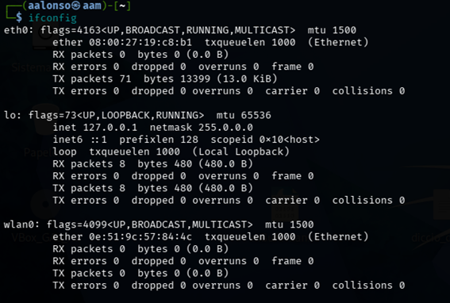
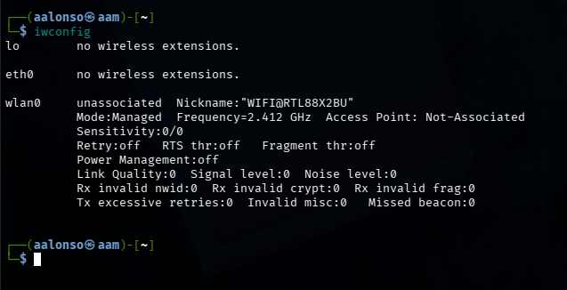
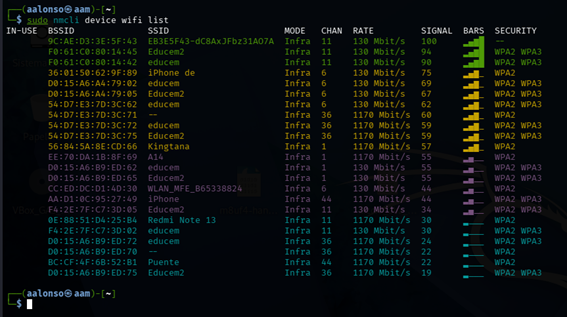

# 01 - Reconocimiento de Red

En esta etapa inicial, verificaremos que nuestra antena WiFi esté correctamente conectada y reconocida por el sistema, y realizaremos un escaneo para identificar los objetivos.

## Comprobación de la Antena

Antes de empezar, debemos saber cómo se llama nuestra interfaz inalámbrica (normalmente `wlan0`).

### ifconfig (Interface Config)
Muestra todas las interfaces de red del sistema (Ethernet, WiFi, Loopback).
- **Para qué sirve**: Para ver si la interfaz está "arriba" (UP) y si tiene una dirección IP asignada.
```bash
ifconfig
```


### iwconfig (Wireless Config)
Es como `ifconfig`, pero especializado en redes inalámbricas.
- **Para qué sirve**: Muestra parámetros específicos como el SSID al que estás conectado, la potencia de la señal (Tx-Power), la frecuencia y, sobre todo, el **Modo** (Managed, Monitor, etc.).
```bash
iwconfig
```


---

## Escaneo de Redes (BSSID y SSID)

Ahora buscaremos redes a nuestro alrededor para auditar.

### nmcli (Network Manager CLI)
Es una herramienta moderna para gestionar redes desde la terminal.
```bash
sudo nmcli device wifi list
```
**¿Qué significan las columnas?**
- **BSSID**: La dirección MAC física del router (el "nombre real" del hardware).
- **SSID**: El nombre de la red que vemos en nuestros dispositivos.
- **CHAN**: El canal en el que emite. Identificarlo es vital para sintonizar nuestra antena luego.
- **BARS**: La intensidad de la señal.
- **SECURITY**: El tipo de cifrado (WPA2, WPA3, etc.).


