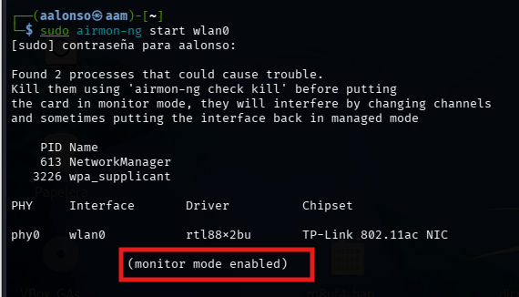
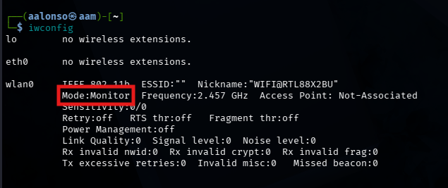
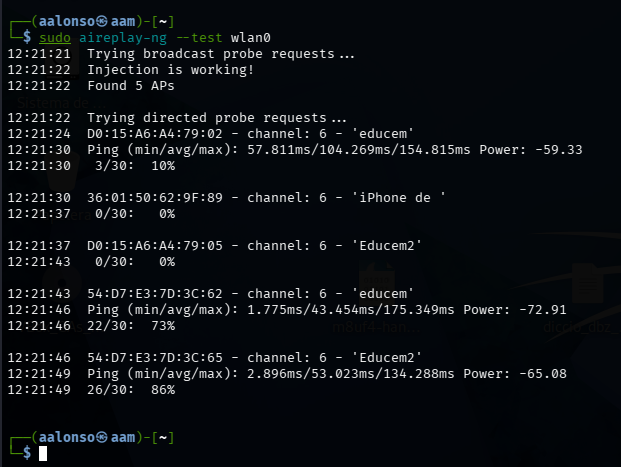

# 02 - Activación del Modo Monitor

Por defecto, las tarjetas WiFi están en modo **Managed** (solo escuchan lo que va dirigido a ellas). Para auditar, necesitamos el modo **Monitor** (escuchar todo el tráfico del aire).

## Activar Modo Monitor con airmon-ng

`airmon-ng` es un script que gestiona el cambio de modos y elimina procesos que puedan interferir.

```bash
sudo airmon-ng start wlan0
```

**Explicación del comando**:
- `start`: Ordena a la tarjeta entrar en modo monitor.
- `wlan0`: El nombre de tu interfaz inalámbrica.

> [!TIP]
> Si el comando te avisa de "conflicting processes", puedes ejecutar `sudo airmon-ng check kill` para cerrarlos automáticamente.




## Test de Inyección

No todas las tarjetas que entran en modo monitor pueden "inyectar" paquetes (es decir, enviar paquetes falsos para ataques). Vamos a probarlo:

```bash
sudo aireplay-ng --test wlan0
```


**¿Qué buscamos aquí?**
- Si ves un mensaje de **"Injection is working!"**, tu tarjeta es apta para ataques de desautenticación.
- También verás el porcentaje de paquetes recibidos, lo que te indica si estás lo suficientemente cerca del objetivo.


