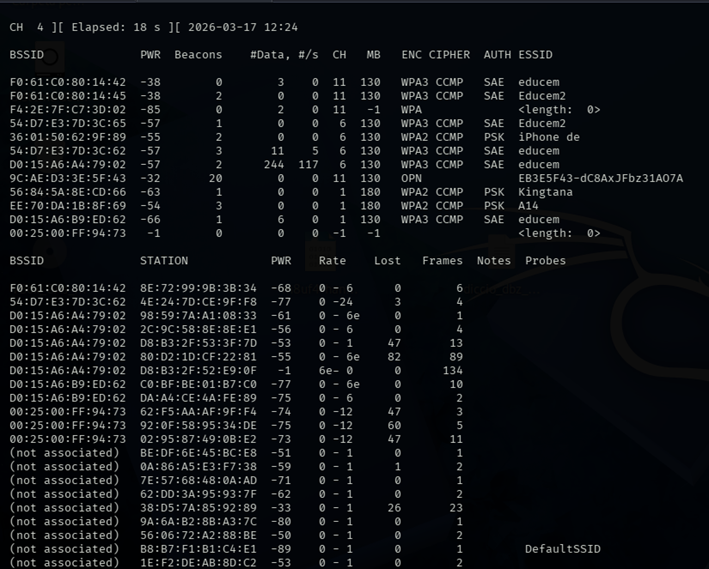
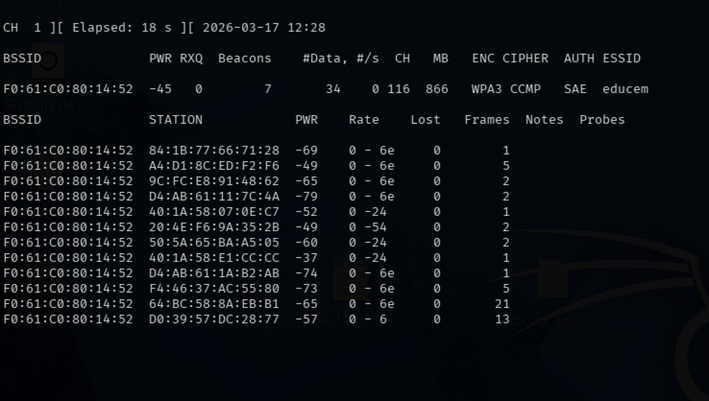
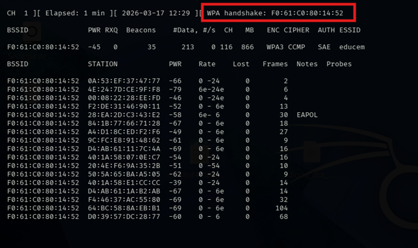

# 03 - Captura de Paquetes y Ataques

Esta es la fase donde obtenemos los datos necesarios para intentar descifrar la contraseña.

## Escaneo Técnico con Airodump-ng

A diferencia de `nmcli`, `airodump-ng` muestra tráfico en tiempo real y detecta clientes conectados.

```bash
sudo airodump-ng wlan0
```


**¿Qué estamos viendo en pantalla?** 

La pantalla se divide en dos secciones principales:

### Parte Superior: Puntos de Acceso (Routers)
- **BSSID**: La dirección MAC del router.
- **PWR**: Nivel de señal. Cuanto más cerca de 0, mejor (ej: -30 es excelente, -80 es débil).
- **Beacons**: Paquetes de "anuncio" que envía el router.
- **#Data**: Número de paquetes de datos capturados (útil para ver si hay actividad).
- **CH**: Canal en el que emite la red.
- **ENC / CIPHER / AUTH**: El tipo de seguridad (WPA2, CCMP, PSK...).
- **ESSID**: El nombre de la red WiFi.

### Parte Inferior: Estaciones (Clientes conectados)
- **STATION**: La dirección MAC del dispositivo conectado (móvil, PC, etc.).
- **BSSID (en esta sección)**: Indica a qué router de la lista de arriba está conectado ese cliente. Si dice `(not associated)`, el dispositivo está buscando red pero no está conectado.
- **PWR**: Señal del dispositivo cliente.
- **Frames**: Cantidad de paquetes enviados por ese cliente.
- **Probes**: Nombres de redes que el dispositivo ha buscado anteriormente.

---

## Captura Dirigida (Handshake)

Para obtener el **WPA Handshake** (el momento en que un cliente se conecta y envía la clave cifrada), debemos concentrarnos en un solo objetivo.

```bash
sudo airodump-ng -c 1 --bssid 06:A0:65:C2:90:A6 -w captura wlan0
```
**Desglose de parámetros**:
- `-c 1`: Especifica el **canal** (Channel). Evita que la tarjeta salte de un canal a otro.
- `--bssid`: Filtra solo el tráfico de esa dirección MAC específica.
- `-w captura`: Crea archivos (como `captura-01.cap`) donde se guardarán los paquetes.







---

## Ataque de Desautenticación (Deauth)

Si no queremos esperar a que un cliente se conecte solo, podemos forzar su desconexión para que, al reconectarse automáticamente, capturemos el handshake.

### 1. Sincronizar el canal
Obligamos a la tarjeta a estar en la misma frecuencia que el router.
```bash
sudo iwconfig wlan0 channel 6
```

### 2. Lanzar el Ataque Global
Enviamos paquetes de "despedida" falsos en nombre del router para que todos se desconecten.

```bash
sudo aireplay-ng -0 10 -a 06:A0:65:C2:90:A6 wlan0
```
- `-0`: Indica que el ataque es de **Desautenticación**.
- `10`: Número de ráfagas (ataques). 
- `-a`: El BSSID del punto de acceso (Access Point).


### 3. Ataque a un Cliente Específico
Si solo quieres molestar o capturar el handshake de un dispositivo concreto (ej. un móvil):

```bash
sudo aireplay-ng -0 10 -a 06:A0:65:C2:90:A6 -c [MAC_DEL_CLIENTE] wlan0
```
- `-c`: Client MAC. Solo ese dispositivo será desconectado.
