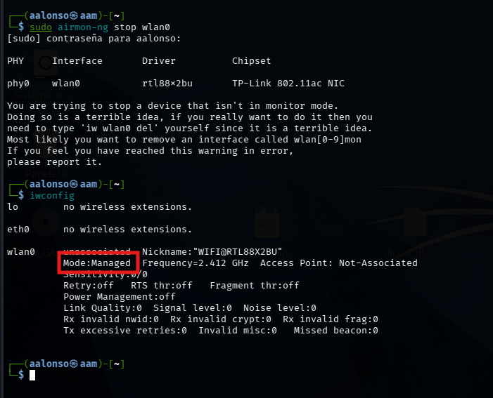

# 04 - Restauración del Sistema

Es importante dejar el sistema limpio después de las pruebas, ya que el modo monitor y haber matado procesos de red te dejará sin internet convencional.

## Detener Modo Monitor

Este comando devuelve la tarjeta a su nombre original (`wlan0`) y modo normal.

```bash
sudo airmon-ng stop wlan0
```


## Reiniciar Servicios de Red

`NetworkManager` es el encargado de gestionar las conexiones WiFi en la interfaz gráfica. Si lo detuvimos (o matamos sus procesos), debemos iniciarlo de nuevo.

```bash
sudo systemctl restart NetworkManager
```

**¿Por qué es necesario?**
Sin esto, es probable que tu gestor de redes aparezca como "no disponible" o no detecte ninguna red Wi-Fi aunque hayas salido del modo monitor.
