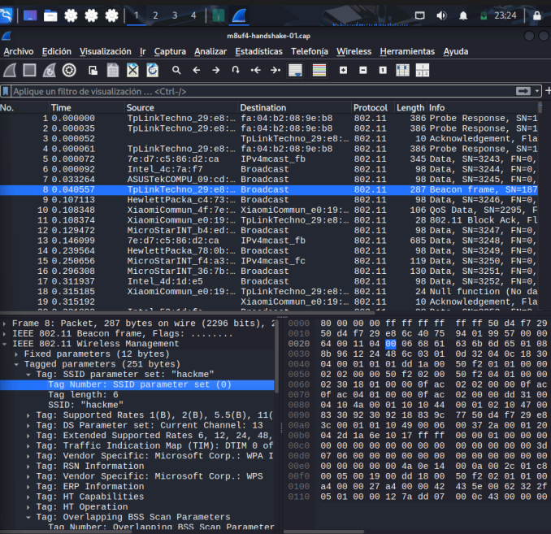
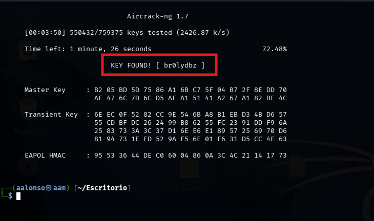

# 05 - Análisis de Capturas y Handshake

En esta fase, analizamos el fichero `.cap` obtenido para extraer información crítica y preparar el crackeo de la contraseña.

## 1. Identificar SSID (Wireshark)

Para saber el nombre de la red de una captura:

1.  **Filtro**: `wlan.fc.type_subtype == 0x08` (Muestra solo los Beacon Frames).
2.  **Ruta del parámetro**:
    - IEEE 802.11 Wireless Management
    - Tagged parameters
    - **Tag: SSID parameter set (0)** -> Aquí verás el nombre real.



---

## 2. Obtener el Hash del Handshake (Aircrack-ng)

Una vez identificado el SSID, usamos `aircrack-ng` sobre el archivo `.cap` para verificar si tenemos el handshake y extraer el hash necesario para herramientas como Hashcat.

```bash
aircrack-ng -w [diccionario] captura-01.cap
```

**Parámetros**:
- `-w`: Ruta al diccionario de contraseñas (necesario para que aircrack intente el crackeo).
- `fichero.cap`: El archivo con los paquetes capturados.

**¿Qué veremos en pantalla?**
Al ejecutarlo, se abrirá una interfaz que muestra:
- El número de redes detectadas en el archivo.
- Si aparece un mensaje como **"1 handshake"** al lado del BSSID, ¡tenemos éxito!



### ¿Por qué usar Aircrack-ng antes que Hashcat?

A diferencia de Hashcat, que está diseñado para el crackeo masivo por fuerza bruta usando la potencia de la tarjeta gráfica (GPU), `aircrack-ng` es ideal para esta fase por su rapidez y sencillez:

| Característica | Aircrack-ng | Hashcat |
| :--- | :--- | :--- |
| **Objetivo** | Verificación rápida y crackeo ligero. | Crackeo profesional de alta velocidad. |
| **Hardware** | Usa el procesador (CPU). | Usa la tarjeta gráfica (GPU). |
| **Facilidad** | Muy sencillo, lee archivos `.cap` directamente. | Complejo, requiere convertir el `.cap` a `.hc22000`. |
| **Uso ideal** | Comprobar si hay handshake en la captura. | Crackear contraseñas complejas. |

Este proceso es el paso previo a usar potencia de cálculo (GPU) con Hashcat si la contraseña no es sencilla.
